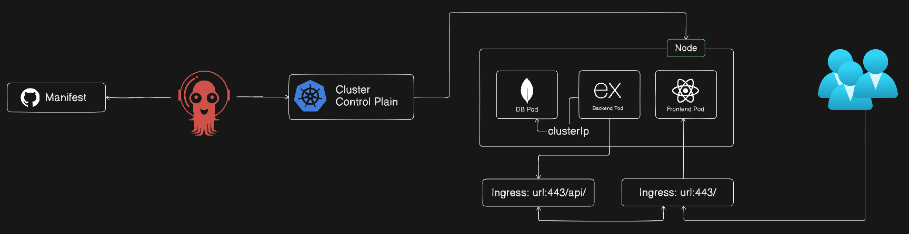
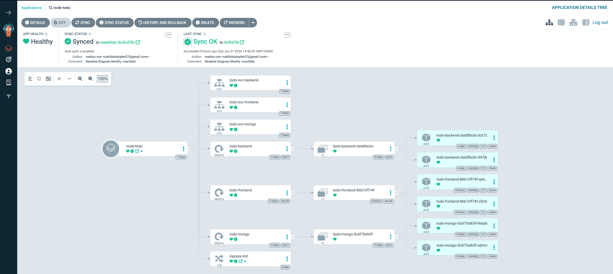

# Node Todo Kubernetes Manifests

Kubernetes manifests for the Node Todo app: React frontend, Express backend, and MongoDB database.

## Kubernetes Cluster Diagram



## ArgoCD Deployment



ArgoCD can watch this `manifest/` folder and sync the Kubernetes resources into the cluster.

## Architecture

```text
User -> todo-svc-frontend:30080 -> todo-frontend pods
Backend API -> todo-svc-backend:30090 -> todo-backend pods
todo-backend -> todo-svc-mongo:27017 -> todo-mongo pods
```

Backend MongoDB connection:

```env
MONGODB_URI=mongodb://todo-svc-mongo:27017/node_todo
```

## Kubernetes Resources

| Component | Deployment | Service | Type | Port |
| --- | --- | --- | --- | --- |
| Frontend | `todo-frontend` | `todo-svc-frontend` | NodePort | `30080 -> 80` |
| Backend | `todo-backend` | `todo-svc-backend` | NodePort | `30090 -> 5000` |
| MongoDB | `todo-mongo` | `todo-svc-mongo` | ClusterIP | `27017` |

All deployments use `2` replicas.

## Images

| Component | Image |
| --- | --- |
| Frontend | `sakibtalukqder/todo-client-prod:a0124b6` |
| Backend | `sakibtalukqder/todo-server-prod:d2991b7` |
| MongoDB | `mongo:latest` |

## Deploy

From the repository root:

```bash
kubectl apply -f manifest/deployments/
kubectl apply -f manifest/services/
```

Check status:

```bash
kubectl get pods
kubectl get services
```

Access the app:

```text
Frontend: http://<node-ip>:30080
Backend:  http://<node-ip>:30090
```

## ArgoCD Settings

| Setting | Value |
| --- | --- |
| Path | `manifest` |
| Namespace | `default` |
| Sync Policy | Manual or Automatic |
