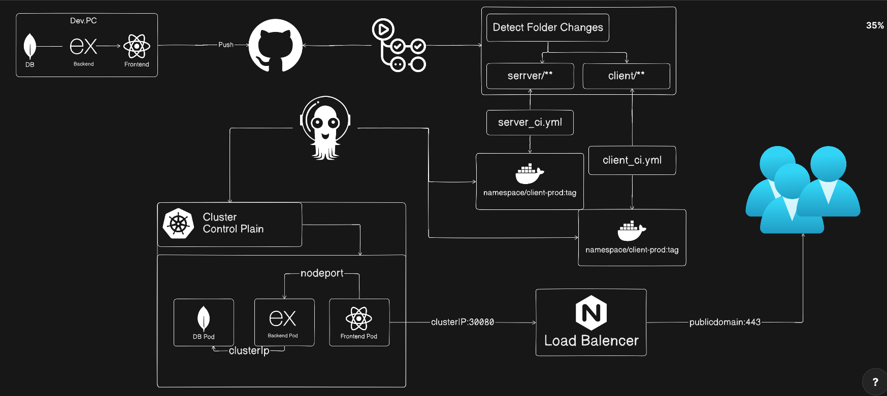

# Node Todo

A small MERN todo app for DevOps practice. It has a React/Vite client, Express API, MongoDB storage, Docker files, and Kubernetes manifests.

## DevOps / CI-CD Process

This project uses a simple CI/CD flow:



1. A developer changes the code and pushes it to GitHub.
2. GitHub Actions checks which folder changed:
   - If `client/**` changes, `.github/workflows/client_ci.yml` runs.
   - If `server/**` changes, `.github/workflows/server_ci.yml` runs.
3. The workflow logs in to Docker Hub.
4. Docker Buildx is set up, then the Docker image is built.
5. If the build succeeds, the image is pushed to Docker Hub:
   - Client image: `DOCKER_USER/todo-client-prod:latest`
   - Server image: `DOCKER_USER/todo-server-prod:latest`
6. The Kubernetes manifests in `manifest/deployment.yml` and `manifest/services.yml` can be used to run the app in a cluster.

Short version:

```text
Code Push -> GitHub Actions -> Docker Build -> Docker Hub Push -> Kubernetes Deploy
```

Important CI/CD parts:

| Part | Purpose |
| --- | --- |
| GitHub Actions | Runs the automated build workflows |
| Dockerfile | Builds the client and server images |
| Docker Hub | Stores the production images |
| Kubernetes Deployment | Runs the client, server, and MongoDB pods |
| Kubernetes Service | Manages network access for the app |

Required GitHub Secrets:

| Secret | Purpose |
| --- | --- |
| `DOCKER_USER` | Docker Hub username |
| `DOCKER_PASSWORD` | Docker Hub password or access token |

Note: The current workflow automatically builds images and pushes them to Docker Hub. The Kubernetes deployment step is currently manual:

```bash
kubectl apply -f manifest/deployment.yml
kubectl apply -f manifest/services.yml
```

## Features

- Add, edit, complete, delete, search, and filter todos.
- Clear all completed tasks.
- Track time spent on each todo with start, stop, and reset controls.
- Progress summary for completed work.
- REST API with `/api/health` and `/api/todos`.
- Docker-ready client, server, and MongoDB setup.

## Stack

| Part | Tech |
| --- | --- |
| Client | React, Vite |
| API | Node.js, Express |
| Database | MongoDB, Mongoose |
| DevOps | Docker, Docker Compose, Kubernetes manifests |

## Run Locally

Backend:

```bash
cd server
npm install
npm run dev
```

Frontend:

```bash
cd client
npm install
npm run dev
```

Default URLs:

- Client: `http://localhost:5173`
- API: `http://localhost:5000`
- Health: `http://localhost:5000/api/health`

## Environment

Create `server/.env`:

```env
PORT=5000
MONGODB_URI=mongodb://localhost:27017/node_todo
CLIENT_URL=http://localhost:5173
```

When the backend runs inside Docker, use:

```env
MONGODB_URI=mongodb://mongo:27017/node_todo
```

## Docker

Start backend and MongoDB:

```bash
docker compose up --build
```

Stop services:

```bash
docker compose down
```

Remove containers and MongoDB volume:

```bash
docker compose down -v
```

## API

| Method | Endpoint | Purpose |
| --- | --- | --- |
| GET | `/api/health` | API health check |
| GET | `/api/todos` | List todos |
| POST | `/api/todos` | Create todo |
| PATCH | `/api/todos/:id` | Update title or status |
| DELETE | `/api/todos/:id` | Delete todo |

## Notes

- Keep `.env`, secrets, and local logs out of Git.
- Use CI/CD secrets for production values.
- Build and tag Docker images from the `client` and `server` folders.
